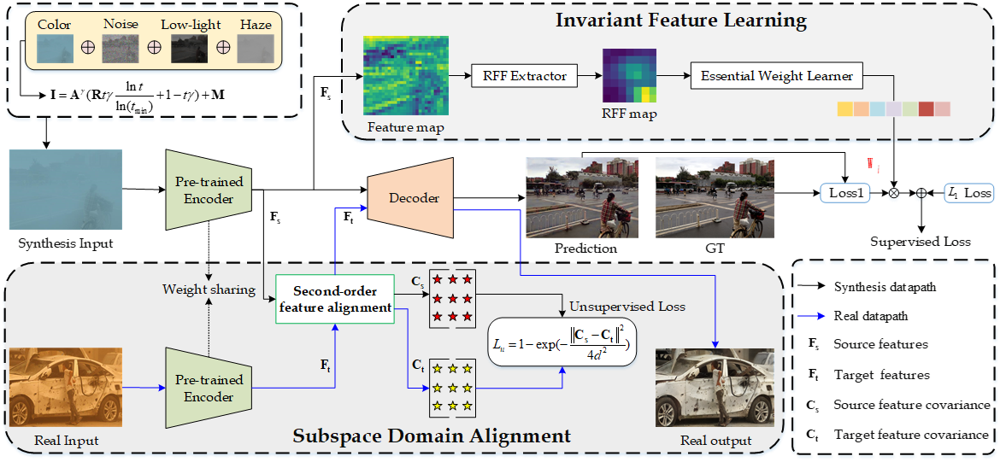
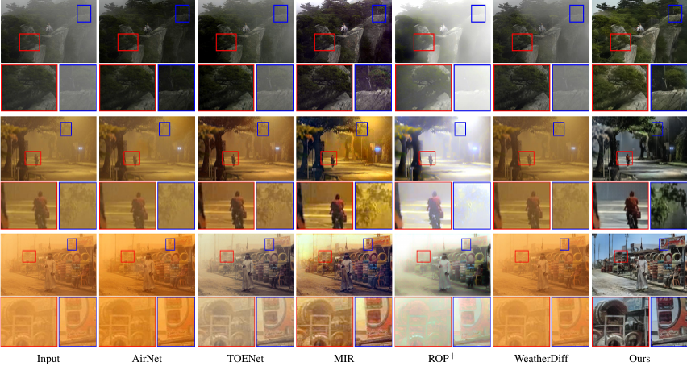

 
# Towards Cross-scene Image Dehazing via Multi-domain Data Generation and Adaptation

This is the official PyTorch implementation of CID
## Abstract:
Restoring images in haze scenes is a challenging
but widely concerned topic in computer vision. The mainstream learning-based approaches primarily obtain the enhanced model by relying on the distribution of training data from the specific scenes, causing poor generalization (even invalid) when
encountering previously unseen real-world hazy images. The
main obstacle lies in the domain migration conundrums caused
by the distribution differences across different hazy scenarios.
To address this issue, we first explore the visual and physical
properties between haze scenes through statistical analysis and
construct a multi-domain haze data generation pipeline that
encapsulates multiple degradation factors (e.g., haze, low-light,
noise, color cast, etc.) to bridge the distribution gap between synthetic data and real haze scenes. Next, we introduce the domain
adaptive learning paradigm to model the above problem from the
perspective of subspace domain alignment and domain invariant
feature learning. The pre-trained semi-supervised framework is
designed to endow the encoder with scene-independent generality
towards different scenarios (i.e., freezing the encoder in the
adaptation and testing phases). Further, in the unsupervised
training phase, we establish the second-order statistical feature
covariance alignment strategy to reduce the feature distance
between the source domain and target domain data in the
transformed subspace. And, in the supervised training stage, we
remove the spurious correlation between features by learning the
weights of the source domain sample data in the representation
space, so as to obtain domain invariant features. Finally, plenty
of experiments and ablation studies on multiple challenging real
haze data indicate our method’s superiority in image quality and
scenario adaptability against existing state-of-the-art methods.
Applications on vehicle object detection also reveal the latent
practical values for the proposed method.


## Environment:

- Windows: 10

- CUDA Version: 11.0 
- Python 3.7

## Dependencies:

- torch==1.7.0
- torchvision==0.7.0
- NVIDIA GPU and CUDA

## Pretrained Weights & Dataset

1. Download [Dehaze weights](https://pan.baidu.com/s/1N5DuuqQEyAUtk8Ec6tLCpw?pwd=tib6) and Extraction code: [tib6]
2. Load the pre-trained weights [Res2Net](https://pan.baidu.com/s/14JAHqX0xvFTpGXAqVBqMCQ) and Extraction code: [1234]
3. Our training data will be released once it's sorted out. Data layer generalization can be achieved with our data.
. 

## train
Our training code will be released once it's sorted out.

 

## Test

Our test run is simple, just change the input and output paths according to your requirements

```
python TMM_test.py
```

## Qualitative Results

 
 

## Acknowledgement

**

 
## Citation

**


 
